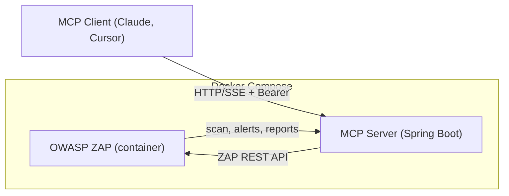

# MCP ZAP Spring Boot Server

A Dockerized Spring Boot application exposing OWASP ZAP as an MCP (Model Context Protocol) server. It lets any MCP‑compatible AI agent (e.g., Claude Desktop, Cursor) orchestrate ZAP actions—spider, active scan, import OpenAPI specs, and generate reports.

---

## Features
- **MCP server**: Exposes ZAP actions as MCP tools
- **OpenAPI integration**: Import remote or uploaded OpenAPI specs into ZAP and kick off active scans
- **Report generation**: Generate HTML/JSON reports and fetch contents programmatically
- **Dockerized**: Runs ZAP and the MCP server in containers, orchestrated via docker-compose
- **Secure**: Configure API keys for both ZAP (ZAP_API_KEY) and the MCP server (MCP_API_KEY)

## Architecture

