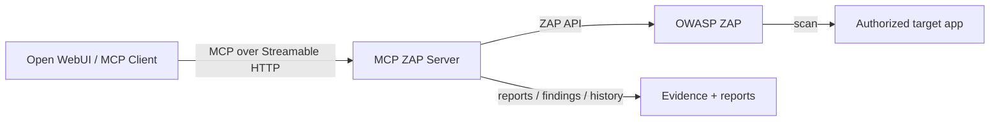

> **Note** This project is not affiliated with or endorsed by OWASP or the OWASP ZAP project. It is an independent implementation.

# MCP ZAP Server

Give AI agents a safe, self-hosted OWASP ZAP operator for guided web security scans, findings, reports, and production guardrails.

`mcp-zap-server` exposes OWASP ZAP through MCP over streamable HTTP so agentic tools can run operator-controlled security workflows without brittle glue scripts or unsafe scanner access.

Use it when you want:

- **safe agentic scanning** with guided defaults for spider, active scan, passive scan, API imports, findings, and reports
- **operator control** through API-key or JWT auth, tool scopes, runtime policy bundles, rate limits, and audit events
- **self-hosted deployment** with Docker Compose for local adoption and Helm for Kubernetes
- **expert ZAP access** when you intentionally need lower-level ZAP context, user, scan, and report controls

Full documentation: [danieltse.org/mcp-zap-server](https://danieltse.org/mcp-zap-server/)

Watch the demo: [browser demo](https://danieltse.org/mcp-zap-server/demo.html) or [YouTube](https://www.youtube.com/watch?v=9_9VqsL0lNw)

<a href="https://www.youtube.com/watch?v=9_9VqsL0lNw" target="_blank" rel="noopener noreferrer">
  
</a>

## Quick Start

Prerequisites:

- Docker 20.10+
- Docker Compose v2 (`docker compose`)
- an MCP-capable client, or the bundled Open WebUI client

```bash
git clone https://github.com/dtkmn/mcp-zap-server.git
cd mcp-zap-server

cp .env.example .env

# Generate values for ZAP_API_KEY and MCP_API_KEY, then put them in .env.
openssl rand -hex 32
openssl rand -hex 32

docker compose up -d
```

Then open:

- Open WebUI: `http://localhost:3000`
- MCP endpoint for host-side clients: `http://localhost:7456/mcp`

The default Compose stack publishes host ports on `127.0.0.1` only. Set `MCP_ZAP_BIND_ADDRESS=0.0.0.0` only when you intentionally expose the stack behind trusted network controls.

Client setup:

- [Authentication Quick Start](https://danieltse.org/mcp-zap-server/getting-started/authentication-quick-start/)
- [MCP Client Configuration](https://danieltse.org/mcp-zap-server/getting-started/mcp-client-authentication/)
- [Tool Surfaces](https://danieltse.org/mcp-zap-server/getting-started/tool-surfaces/)
- [Agent install notes](./llms-install.md)

## Discovery Metadata

This repository includes MCP Registry metadata in [`.mcp/server.json`](./.mcp/server.json). New Docker builds are labeled with the MCP server name expected by registry and catalog tooling.

The honest installation path is Docker Compose because the MCP server is designed to operate with an OWASP ZAP sidecar and explicit auth keys. The registry metadata intentionally does not advertise an OCI package until a newly tagged labeled image and a tested single-image Docker run path exist.

## What You Get

- **Guided scans**: intent-first tools for spider, active scan, passive scan, API imports, findings, reports, and scan history.
- **Expert ZAP control**: optional lower-level tools for advanced ZAP context, user, scan, and report workflows.
- **Authentication**: API key mode by default, optional JWT mode with refresh and revocation support.
- **Runtime policy bundles**: dry-run and enforcement support through `zap_policy_dry_run` and policy-mode configuration.
- **Scan queue and history**: queued active, spider, and AJAX Spider jobs with claim-based recovery, durable Postgres state, and evidence export.
- **Extension contracts**: experimental policy, protection, evidence metadata, and extension metadata APIs with sample extension packaging.
- **Operational guardrails**: request body limits, rate limits, workspace quotas, tool-scope authorization, structured logs, metrics, and audit events.
- **Deployment paths**: local Docker Compose, production-oriented Compose, and Helm charts for Kubernetes.

## Latest Release

`v0.8.0` adds:

- public-preview extension API publication and standalone extension examples
- scan history release-evidence and customer-handoff tools
- HA queue claim fencing, dispatcher/result-applier boundaries, and Postgres race coverage
- Docker image packaging hardening, MCP Docker catalog labeling, and native-image port alignment
- MCP Registry metadata and agent install notes for marketplace discovery

Read the full notes:

- [Release notes](./RELEASE_NOTES_0.8.0.md)
- [Changelog](./CHANGELOG.md)
- [GitHub releases](https://github.com/dtkmn/mcp-zap-server/releases)

## Security Defaults

The default posture is intentionally conservative:

- `api-key` mode is the base runtime default.
- `none` mode is for explicit local dev/test only.
- Docker Compose binds published ports to loopback by default.
- URL validation blocks localhost, private networks, and link-local targets by default.
- Guided auth uses credential reference allowlisting for server-side secrets.
- Public auth exchange endpoints are rate-limited.
- MCP request bodies have a hard early size cap.

Production and shared deployments should review:

- [Security Modes](https://danieltse.org/mcp-zap-server/security-modes/)
- [JWT Authentication](https://danieltse.org/mcp-zap-server/security-modes/jwt-authentication/)
- [Authenticated Scanning Best Practices](https://danieltse.org/mcp-zap-server/scanning/authenticated-scanning-best-practices/)
- [Abuse Protection](https://danieltse.org/mcp-zap-server/operations/abuse-protection/)
- [Production Readiness Checklist](https://danieltse.org/mcp-zap-server/operations/production-checklist/)
- [Security Policy](./SECURITY.md)

## Architecture


```mermaid
flowchart LR
  Client["Open WebUI / MCP Client"] -->|"MCP over Streamable HTTP"| MCP["MCP ZAP Server"]
  MCP -->|"ZAP API"| ZAP["OWASP ZAP"]
  ZAP -->|"scan"| Target["Authorized target app"]
  MCP -->|"reports / findings / history"| Evidence["Evidence + reports"]
```

For multi-replica queueing, durable Postgres state, claim recovery, and ingress affinity, use the operations docs instead of this README:

- [Queue Coordinator and Worker Claims](https://danieltse.org/mcp-zap-server/operations/queue-coordinator-leader-election/)
- [Local HA Compose Simulation](https://danieltse.org/mcp-zap-server/operations/local-ha-compose/)
- [Scan History Ledger](https://danieltse.org/mcp-zap-server/operations/scan-history-ledger/)
- [Helm Deployment](./helm/mcp-zap-server/README.md)

### Extension Model

ZAP is the first scanner engine, not the whole product boundary. The current
public extension work is intentionally small:

- `mcp-zap-extension-api` packages selected policy, protection, evidence, and
  metadata contracts without core runtime internals.
- [How extensions work](./docs/extensions/README.md) explains the core versus
  extension boundary.
- [Build your own extension](./docs/extensions/BUILD_YOUR_OWN_EXTENSION.md)
  shows the target standalone repository shape.
- [Extension API release policy](./docs/extensions/EXTENSION_API_RELEASE_POLICY.md)
  explains publication stages and compatibility gates.
- [Standalone sample extension](./examples/extensions/standalone-policy-metadata-extension/README.md)
  proves a separate project can compile against the API artifact.

This is not runtime multi-engine support yet. Additional scanner engines need
an adapter design and explicit fail-closed capability boundaries before they
become product claims.

## Documentation Map

Start here:

- [Full documentation](https://danieltse.org/mcp-zap-server/)
- [OSS Extension Model](./docs/extensions/README.md)
- [Authentication Quick Start](https://danieltse.org/mcp-zap-server/getting-started/authentication-quick-start/)
- [MCP Client Authentication](https://danieltse.org/mcp-zap-server/getting-started/mcp-client-authentication/)
- [Tool Surfaces](https://danieltse.org/mcp-zap-server/getting-started/tool-surfaces/)

Scanning:

- [Scan Execution Modes](https://danieltse.org/mcp-zap-server/scanning/scan-execution-modes/)
- [API Schema Imports](https://danieltse.org/mcp-zap-server/scanning/api-schema-imports/)
- [AJAX Spider](https://danieltse.org/mcp-zap-server/scanning/ajax-spider/)
- [Findings and Reports](https://danieltse.org/mcp-zap-server/scanning/findings-and-reports/)

Operations:

- [Runtime Policy Bundles](https://danieltse.org/mcp-zap-server/operations/runtime-policy-bundles/)
- [Observability](https://danieltse.org/mcp-zap-server/operations/observability/)
- [Production Checklist](https://danieltse.org/mcp-zap-server/operations/production-checklist/)
- [Release Evidence Handoff](https://danieltse.org/mcp-zap-server/operations/release-evidence-handoff-runbook/)
- [Native Image Performance](https://danieltse.org/mcp-zap-server/operations/native-image-performance/)

## Open Source Core And Extension Model

`mcp-zap-server` is the Apache-2.0-licensed open-source core. It is intended to be useful on its own for self-hosted MCP and OWASP ZAP workflows.

Private or enterprise capabilities may be built as separate extensions around this core. Those extensions are not required to run the OSS project, and enterprise implementation code is not shipped in this repository.

The boundary is intentional:

- this repository remains the public OSS distribution
- extension points should be documented and kept stable where practical
- private extensions must not weaken the security, licensing, or usability of the OSS core
- security scanning and open-source program entitlements for this repository apply only to this public project

## Contributing And Support

- [Contributing](./CONTRIBUTING.md)
- [Security Policy](./SECURITY.md)
- [Discussions](https://github.com/dtkmn/mcp-zap-server/discussions)
- [Demo video](https://danieltse.org/mcp-zap-server/demo.html)

If this project saves you time or becomes part of your security workflow, you can [sponsor the maintainer](https://github.com/sponsors/dtkmn) to support ongoing maintenance.

Agentic Lab offers optional paid support for teams adopting the public core in production. Commercial support is separate from the Apache-2.0-licensed OSS distribution, and the public core should remain usable without private extensions or paid services.

[Contact Agentic Lab](mailto:agentic.lab.au@gmail.com?subject=Inquiry:%20MCP%20ZAP%20Server%20Commercial%20Support)

## License

Apache License 2.0. Copyright 2025-2026 Daniel Tse. See [LICENSE](./LICENSE).
