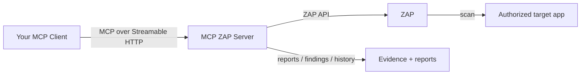

<p align="center">
  
</p>

<h1 align="center">MCP ZAP Server</h1>

<p align="center">
  Give AI agents a safe, self-hosted ZAP operator for guided web security scans, findings, reports, and production guardrails.
</p>

<p align="center">
  
  
  
  
</p>

> **Note** This project is not affiliated with or endorsed by the ZAP project. It is an independent implementation.

`mcp-zap-server` exposes ZAP through MCP over streamable HTTP so agentic tools can run operator-controlled security workflows without brittle glue scripts or unsafe scanner access.

Use it when you want:

- **safe agentic scanning** with guided defaults for spider, active scan, passive scan, API imports, findings, and reports
- **operator control** through API-key or JWT auth, tool scopes, runtime policy bundles, rate limits, and audit events
- **self-hosted deployment** with Docker Compose for local adoption and Helm for Kubernetes
- **expert ZAP access** when you intentionally need lower-level ZAP context, user, scan, and report controls

Full documentation: [danieltse.org/mcp-zap-server](https://danieltse.org/mcp-zap-server/)

An experimental [headless Apple Silicon package](./docs/getting-started/MACOS_PACKAGE.md)
bundles Java and ZAP for HTTP workflows. It is a maintainer-built local preview;
public signing/notarization and fresh-Mac installation remain separate gates.
The [private ChatGPT connection guide](./docs/getting-started/CHATGPT_LOCAL_TUNNEL.md)
explains Secure MCP Tunnel prerequisites and the current verification boundary.

Watch the demo: [browser demo](https://danieltse.org/mcp-zap-server/demo.html) or [YouTube](https://www.youtube.com/watch?v=9_9VqsL0lNw)

<a href="https://www.youtube.com/watch?v=9_9VqsL0lNw" target="_blank" rel="noopener noreferrer">
  
</a>

## Quick Start

Prerequisites:

- Docker 20.10+
- Docker Compose v2 or newer (`docker compose`) with `--wait` and `--wait-timeout` support
- your own MCP client with Streamable HTTP and custom-header support

```bash
git clone https://github.com/dtkmn/mcp-zap-server.git
cd mcp-zap-server

./bin/bootstrap-local.sh --start
```

This creates missing settings, preserves existing keys and workspace data,
and starts a versioned release image. It reports ready after container health
and authenticated MCP checks pass.

Use [Self-Serve First Run](./docs/getting-started/SELF_SERVE_FIRST_RUN.md) for
version selection, configuration, stopping/restarting, startup timeouts,
and recovery. For source builds, use the
[contributor setup](./CONTRIBUTING.md#local-stack).

Connect your MCP client:

- MCP endpoint for host-side clients: `http://localhost:7456/mcp`
- Authentication: send `MCP_API_KEY` from `.env` in the `X-API-Key` header
- [Client setup for Codex, Cursor, and other MCP clients](./docs/src/content/docs/getting-started/mcp-client-authentication.md)

The stack runs the MCP server, ZAP, and demo targets. Install and configure
your preferred MCP client separately.

After connecting, try this first prompt:

```text
Use the guided ZAP tools to crawl http://juice-shop:3000. Wait for the crawl
and passive analysis to finish, show a findings summary, generate an HTML
report, and read it back through MCP. Do not run an active scan.
```

Expect a completed crawl, a findings summary, and a report the client can
read. Use the container URL `http://juice-shop:3000` for this scan; the host
preview `http://localhost:3001` is for your browser. Finding counts vary;
a connection or scan error is not a clean result.

The default stack binds published ports to loopback. Review
[Quick Start Security](./QUICK_START_SECURITY.md) before changing access or
scan-target settings. [Agent install notes](./llms-install.md) cover setup
permissions and standalone OCI use.

## Discovery Metadata

This repository includes MCP Registry metadata in [`.mcp/server.json`](./.mcp/server.json).
Use metadata from the same version as the image you deploy. The image includes
the MCP server name expected by registry and catalog tooling. Check
[GitHub Releases](https://github.com/dtkmn/mcp-zap-server/releases) and the
release workflow before installing a versioned image or publishing its package
metadata; repository metadata alone is not proof of image availability.

Docker Compose remains the easiest installation path because the MCP server is designed to operate with a ZAP sidecar and explicit auth keys. The OCI package metadata is for advanced standalone installs where ZAP is already running and reachable from the MCP container.

## What You Get

- **Guided scans**: intent-first tools for spider, active scan, passive scan, API imports, findings, reports, and scan history.
- **Expert ZAP control**: optional lower-level tools for advanced ZAP context, user, scan, and report workflows.
- **Authentication**: API key mode by default, optional JWT mode with refresh and revocation support.
- **Runtime policy bundles**: dry-run and enforcement support through `zap_policy_dry_run` and policy-mode configuration.
- **Scan queue and history**: queued active, traditional spider, AJAX Spider, and Client Spider jobs with claim-based recovery, durable Postgres state, and evidence export.
- **Extension contracts**: experimental policy, protection, evidence metadata, and extension metadata APIs with sample extension packaging.
- **Operational guardrails**: request body limits, rate limits, workspace quotas, tool-scope authorization, structured logs, metrics, and audit events.
- **Deployment paths**: local Docker Compose, published JVM container images, and Helm charts for Kubernetes.

In `v0.13.0`, Client Spider and browser authentication profiles support direct and queued browser crawling. See the [Client Spider guide](./docs/src/content/docs/scanning/client-spider.md) for setup, authenticated crawling, and reports. These features are not included in `v0.12.0`.

## Version 0.15.0

See [GitHub Releases](https://github.com/dtkmn/mcp-zap-server/releases/latest)
for the latest published version and its publication date. Version-specific
documentation describes that version's behavior; it does not announce image
availability. Deploy only after the corresponding release workflow succeeds
and the versioned image is available in your registry.

Version `v0.15.0` introduces optional OpenAPI imports from client-supplied content
and complete paged report retrieval. Target-scoped reports remove unrelated
shared-session data, HTTP crawl depth is configured independently from child
count, and health checks reapply mandatory outbound settings when ZAP starts
late or its engine is replaced. Review the storage and configuration requirements
before enabling content import or upgrading an existing deployment.

It also includes a [CloudFormation EKS starter](./examples/aws-eks/) and shared
repository/website walkthrough. A live single-worker evaluation using the
published `v0.15.0` image and matching chart verified bootstrap, MCP access with
JWT authentication, crawl/passive/report flows against an owned target, report
persistence after MCP replacement and settled network-policy paths; see the
walkthrough for validation scope.

- [0.15.0 release notes and upgrade guidance](./docs/releases/RELEASE_NOTES_0.15.0.md)
- [Release notes archive](./docs/releases/README.md)
- [Changelog](./CHANGELOG.md)

## Version 0.14.0

**Version `v0.14.0`** hardens API-key configuration, JWT revocation and refresh,
Automation Framework plans, OpenAPI target overrides, HTTP metrics, and Helm
ingress policy. It also adopts Gateway Core and the Spring WebFlux adapter
`0.11.0`, including shared governance audits and active-tool validation.
Read the upgrade notes before deploying: the legacy API-key property is removed,
JWT backend failures fail closed, and accepted automation inputs and audit fields
have changed. Preparing or merging this version does not publish its release or
container images.

- [0.14.0 release notes and migration requirements](./docs/releases/RELEASE_NOTES_0.14.0.md)

## Security Defaults

The default posture is intentionally conservative:

- `api-key` mode is the base runtime default.
- `none` mode is for explicit local dev/test only.
- Docker Compose binds published ports to loopback by default.
- The Java 25 JVM image uses a digest-pinned distroless runtime with no shell or
  package manager; debug it through logs, metrics, and external diagnostic
  containers rather than installing tools into the application container.
- URL validation blocks localhost, private networks, and link-local targets by default.
- Target authentication is optional and profiles default to an empty list. When enabled, guided auth binds an exact server-side credential reference and login settings to one approved origin; callers provide only `profileId` and `targetUrl`.
- Public auth exchange endpoints are rate-limited.
- MCP request bodies have a hard early size cap.

For a first private AWS deployment without Kubernetes, use [AWS EC2 with Docker Compose](./docs/operator/runbooks/AWS_EC2_COMPOSE_GUIDE.md) and its [standalone example](./examples/aws-ec2/).

For Kubernetes, use the [EKS infrastructure starter](./examples/aws-eks/) to
create a dedicated evaluation cluster in an existing VPC, then deploy with the
existing Helm chart. A live single-worker trial using the published `v0.15.0`
image and matching chart verified bootstrap, MCP access with JWT authentication
and crawl/report flows against an owned target; see the walkthrough for
validation scope and your own deployment checks.

Production and shared deployments should review:

- [Security Modes](https://danieltse.org/mcp-zap-server/security-modes/)
- [JWT Authentication](https://danieltse.org/mcp-zap-server/security-modes/jwt-authentication/)
- [Optional Target Form-Login](https://danieltse.org/mcp-zap-server/getting-started/form-login-target-authentication/)
- [Authenticated Scanning Reference](https://danieltse.org/mcp-zap-server/scanning/authenticated-scanning-best-practices/)
- [Abuse Protection](https://danieltse.org/mcp-zap-server/operations/abuse-protection/)
- [Production Readiness Checklist](https://danieltse.org/mcp-zap-server/operations/production-checklist/)
- [Security Policy](./SECURITY.md)

## Architecture


```mermaid
flowchart LR
  Client["Your MCP Client"] -->|"MCP over Streamable HTTP"| MCP["MCP ZAP Server"]
  MCP -->|"ZAP API"| ZAP["ZAP"]
  ZAP -->|"scan"| Target["Authorized target app"]
  MCP -->|"reports / findings / history"| Evidence["Evidence + reports"]
```

For multi-replica queueing, durable Postgres state, claim recovery, and ingress affinity, use the operations docs instead of this README:

- [Queue Coordinator and Worker Claims](https://danieltse.org/mcp-zap-server/operations/queue-coordinator-leader-election/)
- [Multi-Replica Deployment Requirements](https://danieltse.org/mcp-zap-server/operations/local-ha-compose/)
- [Scan History Ledger](https://danieltse.org/mcp-zap-server/operations/scan-history-ledger/)
- [Helm Deployment](./helm/mcp-zap-server/README.md)

### Extension Model

ZAP is the first scanner engine, not the whole product boundary. The current
public extension work is intentionally small:

- `mcp-zap-extension-api` packages selected policy, protection, evidence, and
  metadata contracts without gateway runtime internals.
- [How extensions work](./docs/extensions/README.md) explains the core versus
  extension boundary.
- [Build your own extension](./docs/extensions/BUILD_YOUR_OWN_EXTENSION.md)
  shows the target standalone repository shape.
- [Extension API release policy](./docs/extensions/EXTENSION_API_RELEASE_POLICY.md)
  explains publication stages and compatibility gates.
- [Standalone sample extension](./examples/extensions/standalone-policy-metadata-extension/README.md)
  proves a separate project can compile against the API artifact.

This is not runtime multi-engine support yet. Additional scanner engines need
an adapter design and explicit fail-closed capability boundaries before they
become product claims.

## Documentation Map

Start here:

- [Full documentation](https://danieltse.org/mcp-zap-server/)
- [Self-Serve First Run](https://danieltse.org/mcp-zap-server/getting-started/self-serve-first-run/)
- [OSS Extension Model](./docs/extensions/README.md)
- [MCP Access Authentication](https://danieltse.org/mcp-zap-server/getting-started/authentication-quick-start/)
- [MCP Client Authentication](https://danieltse.org/mcp-zap-server/getting-started/mcp-client-authentication/)
- [Optional Target Form-Login](https://danieltse.org/mcp-zap-server/getting-started/form-login-target-authentication/)
- [Tool Surfaces](https://danieltse.org/mcp-zap-server/getting-started/tool-surfaces/)

Scanning:

- [MCP Client Scan To Evidence](https://danieltse.org/mcp-zap-server/scanning/mcp-client-scan-to-evidence/)
- [Scan Execution Modes](https://danieltse.org/mcp-zap-server/scanning/scan-execution-modes/)
- [Seeded API Gate Playbook](https://danieltse.org/mcp-zap-server/scanning/seeded-api-gate-playbook/)
- [API Schema Imports](https://danieltse.org/mcp-zap-server/scanning/api-schema-imports/)
- [AJAX Spider](https://danieltse.org/mcp-zap-server/scanning/ajax-spider/)
- [Client Spider (v0.13.0)](https://danieltse.org/mcp-zap-server/scanning/client-spider/)
- [Findings and Reports](https://danieltse.org/mcp-zap-server/scanning/findings-and-reports/)

Operations:

- [Runtime Policy Bundles](https://danieltse.org/mcp-zap-server/operations/runtime-policy-bundles/)
- [Observability](https://danieltse.org/mcp-zap-server/operations/observability/)
- [Production Checklist](https://danieltse.org/mcp-zap-server/operations/production-checklist/)
- [Release Evidence Handoff](https://danieltse.org/mcp-zap-server/operations/release-evidence-handoff-runbook/)

## Open Source Core And Extension Model

`mcp-zap-server` is the Apache-2.0-licensed open-source core. It is intended to be useful on its own for self-hosted MCP and ZAP workflows.

Private or enterprise capabilities may be built as separate extensions around this core. Those extensions are not required to run the OSS project, and enterprise implementation code is not shipped in this repository.

The boundary is intentional:

- this repository remains the public OSS distribution
- extension points should be documented and kept stable where practical
- private extensions must not weaken the security, licensing, or usability of the OSS core
- security scanning and open-source program entitlements for this repository apply only to this public project

## Contributing And Support

- [Contributing](./CONTRIBUTING.md)
- [Security Policy](./SECURITY.md)
- [Discussions](https://github.com/dtkmn/mcp-zap-server/discussions)
- [Demo video](https://danieltse.org/mcp-zap-server/demo.html)

If this project saves you time or becomes part of your security workflow, you can [sponsor the maintainer](https://github.com/sponsors/dtkmn) to support ongoing maintenance.

Agentic Lab offers optional paid support for teams adopting the public core in production. Commercial support is separate from the Apache-2.0-licensed OSS distribution, and the public core should remain usable without private extensions or paid services.

[Contact Agentic Lab](mailto:agentic.lab.au@gmail.com?subject=Inquiry:%20MCP%20ZAP%20Server%20Commercial%20Support)

## License

Apache License 2.0. Copyright 2025-2026 Daniel Tse. See [LICENSE](./LICENSE).
