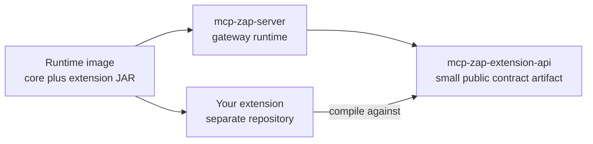

# Build Your Own Extension

This guide describes the intended external extension path for `mcp-zap-server`.

Read this carefully: the extension platform is being shaped, not fully shipped.
The in-repo sample now proves packaging, API-only compilation, and Spring
auto-configuration wiring. That is real progress, but it is still an
experimental developer path, not a public compatibility promise.

## Current State

Supported today:

- core exposes extension contracts in the shared codebase
- a dedicated `mcp-zap-extension-api` artifact is built by the project
- the repository contains a compile-checked sample extension
- the sample compiles against the API artifact instead of the full runtime
- the sample packages separately from the core runtime
- the sample does not contain core, enterprise, or application classes
- compatibility tests prove the sample JAR wires through Spring Boot
  auto-configuration
- a standalone example project shows the external builder shape

Not supported as a stable external platform yet:

- a public Maven Central release of `mcp-zap-extension-api`
- binary compatibility guarantees for third-party extension JARs
- dynamic plugin discovery
- marketplace-style plugin installation
- runtime multi-engine support

The target path is still important because it prevents the wrong habit:
external builders should not fork core or edit the core `build.gradle` just to
add behavior.

## Target Developer Model

The desired shape is:



In that model:

- core owns the MCP tools and runtime orchestration
- the API artifact owns small stable extension contracts
- your extension implements one or more contracts
- the runtime loads your extension through classpath-based Spring wiring
- normal MCP clients keep using the same gateway endpoint and tool names

## Pick A Small Extension Type First

Good first extensions:

- policy hook that allows, denies, or audits selected tools
- access boundary that scopes demo data in a single trust boundary
- metadata or evidence enrichment provider

Bad first extensions:

- a second scanner engine
- a forked MCP tool surface
- direct ZAP ClientApi calls from product logic
- secret or file loading controlled by tool callers
- tenant isolation claims without authz, durable store, and evidence tests

Do not start with Nuclei, Semgrep, Burp, or runtime engine switching. Engine
adapters need the engine extension ADR first.

## Standalone Project Shape

The future external extension should live in its own repository.

Example layout:

```text
acme-mcp-zap-extension/
  build.gradle
  src/main/java/com/acme/mcpzap/extension/
    AcmeExtensionAutoConfiguration.java
    AcmePolicyHook.java
  src/main/resources/
    META-INF/spring/org.springframework.boot.autoconfigure.AutoConfiguration.imports
    META-INF/mcp-zap/extensions/acme.properties
  src/test/java/com/acme/mcpzap/extension/
    AcmePolicyHookTest.java
```

That layout does two different jobs:

- `META-INF/spring/...AutoConfiguration.imports` tells Spring how to discover
  your extension configuration when the JAR is on the runtime classpath.
- `META-INF/mcp-zap/extensions/*.properties` describes the extension for the
  gateway/operator contract.

Classpath alone is not enough. A JAR can compile and still never wire into the
runtime if Spring has no registration metadata or import hook.

## Gradle Dependency

An external extension should depend on the API artifact instead of depending on
the full application.

Current local proof shape:

```gradle
plugins {
    id 'java-library'
}

def extensionApiVersion = providers.gradleProperty('extensionApiVersion')
        .orElse('0.7.0')
        .get()
def extensionApiRepositoryUrl = providers.gradleProperty('extensionApiRepositoryUrl')
        .orElse('../mcp-zap-server/build/extension-api-publication')
        .get()

repositories {
    exclusiveContent {
        forRepository {
            maven {
                url = uri(extensionApiRepositoryUrl)
            }
        }
        filter {
            includeGroup 'mcp.server.zap'
        }
    }
    mavenCentral()
}

dependencies {
    compileOnly "mcp.server.zap:mcp-zap-extension-api:${extensionApiVersion}"
    compileOnly 'org.springframework.boot:spring-boot-autoconfigure:4.0.6'

    testImplementation 'org.junit.jupiter:junit-jupiter:6.0.1'
    testImplementation 'org.assertj:assertj-core:3.27.6'
    testRuntimeOnly 'org.junit.platform:junit-platform-launcher:6.0.1'
}

tasks.named('test') {
    useJUnitPlatform()
}
```

First run `./gradlew verifyExtensionApiPublication` from the gateway repository
so `build/extension-api-publication` exists. The `exclusiveContent` block is
intentional: it prevents `mcp.server.zap:mcp-zap-extension-api` from resolving
from Maven Central or a stale public mirror while this proof is supposed to use
the freshly staged artifact.

This coordinate describes the current staged publication shape. Treat it as
experimental until the project publishes a public artifact repository and
declares a stable compatibility level. The group may still change before a
public artifact is published.

The explicit Spring, JUnit, and AssertJ versions are shown so those third-party
dependencies are resolvable without relying on this repository's build. A
future extension API BOM may own those constraints, but that is not shipped yet.

## Bean Registration

Use Spring Boot auto-configuration or another documented registration mechanism
so the gateway can discover your extension beans.

Target shape:

```java
package com.acme.mcpzap.extension;

import mcp.server.zap.extension.api.policy.PolicyBundleAccessBoundary;
import org.springframework.boot.autoconfigure.AutoConfiguration;
import org.springframework.boot.autoconfigure.condition.ConditionalOnMissingBean;
import org.springframework.boot.autoconfigure.condition.ConditionalOnProperty;
import org.springframework.context.annotation.Bean;

@AutoConfiguration
@ConditionalOnProperty(
        prefix = "acme.mcp-zap.extension",
        name = "enabled",
        havingValue = "true"
)
public class AcmeExtensionAutoConfiguration {

    @Bean
    @ConditionalOnMissingBean(PolicyBundleAccessBoundary.class)
    PolicyBundleAccessBoundary acmePolicyBoundary() {
        return new AcmePolicyBoundary();
    }
}
```

And register it:

```text
# src/main/resources/META-INF/spring/org.springframework.boot.autoconfigure.AutoConfiguration.imports
com.acme.mcpzap.extension.AcmeExtensionAutoConfiguration
```

This is a target pattern for #234. It is not a compatibility promise until the
API artifact and external wiring tests exist.

## Extension Metadata

Every external extension should describe itself with low-risk metadata.

Example:

```properties
id=acme-policy-metadata
name=Acme Policy Metadata Extension
dependsOn=mcp-zap-extension-api
loadsVia=spring-auto-configuration
private=false
type=policy-metadata
```

Metadata should not contain secrets, customer names, private paths, or
environment-specific IDs.

## Runtime Loading

The intended first loading model is deliberately simple:

1. build the core gateway runtime
2. build the extension JAR
3. build a custom runtime image or launch profile that puts the extension JAR on
   the application classpath
4. rely on the documented Spring registration mechanism to wire extension beans

This is not dynamic plugin discovery. It is classpath-based extension wiring.

Do not promise:

- a `/plugins` directory
- hot loading or unloading
- marketplace installation
- arbitrary third-party binary compatibility

Those are separate product decisions.

## Compatibility Rules

An extension should pass these checks before anyone treats it as credible:

- compiles against the extension API artifact only
- imports no `mcp.server.zap.enterprise.*` packages
- imports no ZAP-native APIs unless it is an approved engine adapter
- does not copy core runtime classes into the extension JAR
- does not declare surprise public MCP tools
- has tests for allow, deny, abstain, or enrichment behavior
- has a compatibility test proving the extension bean wires into the gateway

If a behavior is unsupported, fail closed with a clear operator-facing reason.
See [Extension API Compatibility](./EXTENSION_API_COMPATIBILITY.md) for the
current versioning policy.
See [Extension API Release Policy](./EXTENSION_API_RELEASE_POLICY.md) for the
rules that must be satisfied before a public artifact or compatibility promise
exists.

## How The In-Repo Sample Fits

The current sample lives at:

- [Sample Policy Metadata Extension](../../examples/extensions/policy-metadata-extension/README.md)
- [Standalone Policy Metadata Extension](../../examples/extensions/standalone-policy-metadata-extension/README.md)

Use it to understand:

- how an extension can implement a public extension API contract
- how extension metadata is shaped
- how packaging tests prevent core or enterprise classes from leaking into an
  extension artifact
- how a separate Gradle project depends on the API artifact without editing the
  gateway build

Do not treat it as a public binary compatibility promise. It lives inside this
repository so CI can prove the boundary before external samples and public
artifact publishing are promoted.

## What To Wait For

Before marketing the project as a developer-ready extension platform, finish:

- public API artifact publishing
- external standalone sample repository
- compatibility policy graduation beyond experimental
- external sample extension repository or template
- compatibility test that loads an external extension JAR into the gateway
- documented runtime classpath/image pattern

Until then, say the honest thing: the extension model is proven inside the repo,
and the external builder path is the next platform step.

## Related Docs

- [OSS Extension Model](./README.md)
- [Extension API Compatibility](./EXTENSION_API_COMPATIBILITY.md)
- [Extension API Release Policy](./EXTENSION_API_RELEASE_POLICY.md)
- [Sample Policy Metadata Extension](../../examples/extensions/policy-metadata-extension/README.md)
- [Standalone Policy Metadata Extension](../../examples/extensions/standalone-policy-metadata-extension/README.md)
