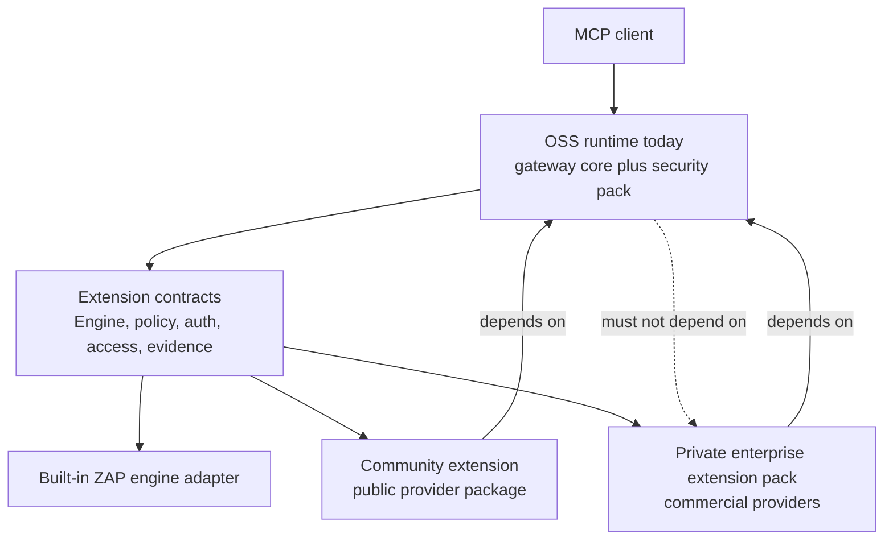

# OSS Extension Model

This document explains how extensions fit around `mcp-zap-server`.

The short version:

- today, the shipped scanner engine is OWASP ZAP
- the product boundary is the MCP-native gateway runtime, not ZAP itself
- extensions plug into public extension contracts
- enterprise uses the same extension pattern privately
- additional scanner engines are future adapter work, not shipped runtime
  multi-engine support

## What The Current OSS Runtime Owns

Today, `mcp-zap-server` contains both the future-extractable gateway core and
the ZAP/security distribution. In this document, "current OSS runtime" means
that whole runnable product, not a separately published generic core module.

The current OSS runtime owns:

- the MCP tool surface
- authentication and tool-scope authorization
- URL guardrails, request limits, and abuse protection
- scan queue admission, retry, and durable coordination
- scan history and report evidence primitives
- normalized gateway records for scan runs, findings, and artifacts
- extension contracts for engines, policy, selected access boundaries, and
  evidence metadata

Some of those responsibilities are future-extractable gateway-core material.
Others are security-pack responsibilities that should remain with the
ZAP/security distribution unless a later extraction ADR proves otherwise.

The current OSS runtime must run without enterprise installed. If removing an
extension breaks the basic gateway, the boundary is wrong.

## What An Extension Is

An extension is a provider that depends on public extension contracts and
changes behavior behind those contracts.

In practice, an extension usually does one of these:

- registers Spring beans that implement core interfaces
- wraps a gateway boundary with additional validation, policy, enrichment, or
  routing
- adds a private provider for policy, tenant/workspace access, auth bootstrap,
  reporting, or evidence handling
- adds future engine adapter behavior only after the engine ADR gates are met

Extensions should not fork the current OSS runtime or require MCP clients to
learn a different product.

## What Ships Today

Today, the supported engine is ZAP.

The public `zap_*` MCP tools remain the supported client surface. Internally,
the gateway is moving scan, findings, report, import, context, automation,
inventory, passive-scan, and runtime behavior behind engine-facing contracts.

That means the architecture is being prepared for more engines, but the current
product does not ship:

- multiple active scanner engines
- per-request engine selection
- Nuclei, Semgrep, Burp, or other engine adapters
- an extension marketplace
- compatibility guarantees for arbitrary third-party binary plugins

If a workflow needs an engine capability that the configured engine does not
support, it must fail closed instead of silently falling back to a weaker scan.

## Extension Points

Use the existing extension points before adding new ones.

Not every row below is part of `mcp-zap-extension-api` yet. The API artifact
currently covers policy hooks, selected protection boundaries, evidence
metadata enrichment, and extension metadata. Engine and auth-bootstrap rows
describe current or future runtime boundaries, not a stable standalone-builder
API.

| Area | Core contracts | Intended extension use |
| --- | --- | --- |
| Engine metadata and capability checks | `EngineAdapter` | Declare what the configured engine can safely do. |
| Scan execution | `EngineScanExecution`, `EngineAjaxSpiderExecution` | Execute start, status, stop, browser crawl, and scan-policy operations behind the gateway boundary. |
| Passive scan state | `EnginePassiveScanAccess` | Read passive-scan backlog and completion state without coupling services to engine-native APIs. |
| Findings and inventory | `EngineFindingAccess`, `EngineInventoryAccess` | Read normalized findings, sites, URLs, hosts, and alert summaries without leaking engine-native calls into services. |
| Reports and artifacts | `EngineReportAccess` | Generate reports and feed evidence without exposing raw engine storage details to callers. |
| API imports and automation | `EngineApiImportAccess`, `EngineAutomationAccess` | Keep OpenAPI, GraphQL, SOAP, and automation-plan behavior behind engine boundaries. |
| Context and auth bootstrap | `EngineContextAccess`, `AuthBootstrapProvider` | Prepare sessions, users, contexts, and target auth without hard-coding customer-specific flows into core. |
| Policy | `ToolExecutionPolicyHook`, `PolicyBundlePreviewer` | Add governance decisions and dry-run preview behavior without replacing MCP tools. |
| Requester identity and access | `WorkspaceIdentityResolver`, `ScanJobAccessBoundary`, `ReportArtifactBoundary`, `PolicyBundleAccessBoundary`, `ScanHistoryAccessBoundary` | Add tenant/workspace-aware visibility and access checks around shared gateway data. |
| Runtime defaults | `EngineRuntimeAccess` | Apply startup runtime defaults and expose engine health/version through a gateway contract. |

These are contracts, not permission to add private logic to the current OSS
runtime. If the extension behavior is not public-safe, keep it outside the OSS
export.

## Enterprise As A Private Extension Pack

Enterprise should be implemented as a private extension pack on top of the same
extension contracts. That is the point of the model.

Enterprise may add private providers for:

- tenant/workspace read boundaries
- policy bundle evaluation overlays
- commercial report or evidence packaging
- guided auth adapters for difficult customer login flows
- operator governance and rollout controls

Enterprise must not require a second core implementation. Normal MCP clients
should keep using the same endpoint and tool names unless an operator
deliberately enables a private control that changes access decisions.

## What Community Builders Should Do

Start with a narrow extension that proves one provider contract.

The repository includes a compile-checked and wiring-tested sample:

- [Sample Policy Metadata Extension](../../examples/extensions/policy-metadata-extension/README.md)
- [Standalone Policy Metadata Extension](../../examples/extensions/standalone-policy-metadata-extension/README.md)
- [Build Your Own Extension](./BUILD_YOUR_OWN_EXTENSION.md)
- [Extension API Compatibility](./EXTENSION_API_COMPATIBILITY.md)
- [Extension API Release Policy](./EXTENSION_API_RELEASE_POLICY.md)

The in-repo sample implements `PolicyBundleAccessBoundary`, registers a
conditional Spring Boot auto-configuration, and packages separately from the
gateway runtime. The standalone sample shows the external project shape that
depends on `mcp-zap-extension-api` through Maven coordinates. Neither sample
adds a scanner engine or a public MCP tool.

That sample is an in-repo proof. The target external workflow is a standalone
extension repository that depends on the dedicated `mcp-zap-extension-api`
artifact, registers through Spring Boot auto-configuration, and ships a
separate extension JAR.

The first API artifact intentionally exposes only stable-looking, boring
contracts: policy hooks, selected access boundaries, metadata or evidence
enrichment contracts, and version compatibility metadata. Queue/history
visibility boundaries that still expose mutable core models remain internal
until they have safe public view types. Engine adapter contracts remain internal
until a real candidate second-engine design satisfies the ADR gates.

Good first extensions:

- policy hook that blocks or audits a small set of tools or hosts
- report metadata provider or evidence-enrichment provider
- access boundary that scopes demo data in a single trust boundary

Bad first extensions:

- a full second scanner engine before the ADR gates are satisfied
- a forked MCP tool surface
- an extension that reads private files or secrets without operator allowlists
- tenant isolation that claims SaaS-grade security without durable store,
  authz, and evidence tests

## Builder Checklist

Before calling something an extension, make sure:

- the current OSS runtime can still boot and pass tests without it
- the extension depends on public contracts, not the other way around
- the extension implements an existing core interface where possible
- public MCP tool names and response contracts remain stable
- secrets and file paths are operator-managed, not caller-selected
- unsupported behavior fails closed with a clear error
- tests prove the extension cannot see data outside its intended boundary
- external builders can eventually build it without editing this repository

## Engine Adapters Are The Later Step

ZAP is the first engine because it already has the deepest implementation and
test coverage in this project.

Additional scanner engines should come through an adapter boundary. The current
design fence is the accepted engine extension ADR. Until the ADR gates are met,
engine work should be limited to mapping the current ZAP interfaces,
documenting candidate-engine pressure, and fencing unsupported claims.

Do not implement Nuclei, Semgrep, Burp, or runtime engine switching just to
prove the extension story. That would add platform surface before the product
has earned it.

## Runtime Loading Model

The current loading model is classpath-based Spring bean wiring.

That means an operator can build a runtime image that includes the current OSS
gateway runtime and an extension JAR on the application classpath. This is
intentionally simpler than a marketplace or dynamic plugin loader.

Classpath is necessary but not sufficient. The runtime also needs a bean
registration mechanism. The in-repo sample is visible because it lives under
the application package scan. A real external extension package should not rely
on that. The external developer path must use Spring Boot auto-configuration
metadata, an explicit import hook, or another documented registration mechanism
so extension beans actually wire into the gateway.

Current limitations:

- the in-repo sample proves packaging, not external binary compatibility
- the extension API artifact is experimental and not a binary compatibility
  promise yet
- no runtime plugin discovery directory is promised
- no marketplace or third-party plugin trust model exists

Until the compatibility policy graduates beyond experimental, do not promise
runtime binary compatibility to external builders.

## Related Docs

- [Extension API Compatibility](./EXTENSION_API_COMPATIBILITY.md)
- [Extension API Release Policy](./EXTENSION_API_RELEASE_POLICY.md)
- [Build Your Own Extension](./BUILD_YOUR_OWN_EXTENSION.md)
- [Standalone Policy Metadata Extension](../../examples/extensions/standalone-policy-metadata-extension/README.md)
- [Sample Policy Metadata Extension](../../examples/extensions/policy-metadata-extension/README.md)
